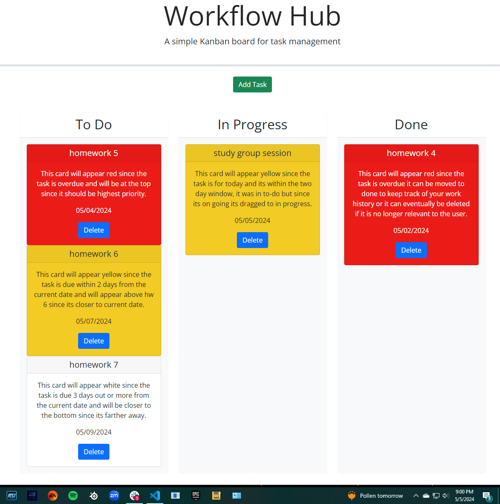

# Workflow-Hub

## Workflow Hub is an app created to assist users in efficiently organizing and monitoring various tasks within a project.

- This user-friendly platform empowers individuals to seamlessly add tasks, oversee their advancement, and visually track their progress. Task Nest proves invaluable to anyone seeking to streamline the organization of their schedules and tasks.

## User Interface

- Users have multiple ways to interact with the task board for efficient task management.
- Users can input task details such as title, description, and deadline by clicking the "Add Task" button, which opens a modal dialog.
- Pressing the "Save" button will save the task in the browser's localStorage, guaranteeing user data persistence even if the browser is refreshed or even closed.
- Users have the ability to drag tasks across different columns to reflect their progress. These updates are automatically saved and will remain intact even when the session is ended or the page is refreshed.
- Users have the ability to permanently remove tasks from the task board by using the "Delete" button located at the bottom of each task card.

**The task board is structured into columns, each representing distinct stages of task progression, facilitating the organization of tasks.**

- To Do: tasks in this stage have been acknowledged but not yet started.
- In Progress: tasks in this phase are presently being addressed.
- Completed: tasks that have concluded.

**The application employs a color coding system to assist users in evaluating the urgency of their tasks.**

- Any task not completed by due date will produce a red card meaning task is past due date.
- Any task that is due on current day or within two days of due date will produce a yellow card meaning task is due soon.
- Any task that is due three days out or more will produce a white card meaning task is coming up in the future.

## Technologies Used

- HTML/CSS for styling and structure.
- JavaScript for the interactive elements and manipulation of local storage.
- Bootstrap for its widely-used toolkit that expedites the creation of responsive and visually appealing interfaces. It ensures a polished appearance and seamless functionality across various devices.
- jQuery UI for utilization of its drag-and-drop functionality, enabling users to effortlessly relocate tasks within the task board interface.

## Screenshot

## Usage

[Link to Deployed Website](https://acoderrose.github.io/Workflow-Hub/)

[Link to GitHub repository](https://github.com/AcoderRose/Workflow-Hub)

## Collaborators

[Jordan Gonzales](https://github.com/JordanGWiz)

[Kaila Ronquillo](https://github.com/girlnotfound)

[Ryan Petersen](https://github.com/RyanPetersen-89)
